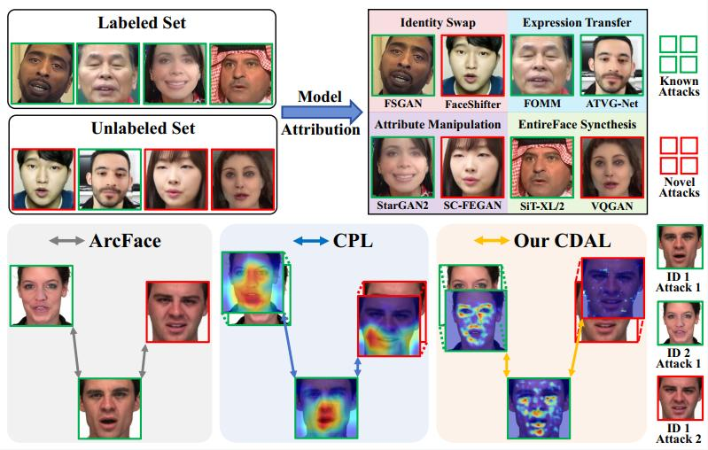

# 🔍ICCV 2025🔍 Learning Counterfactually Decoupled Attention for Open-World Model Attribution

[Yu Zheng*](https://yzheng97.github.io/), [Boyang Gong*](https://github.com/wfr429), Fanye Kong, [Yueqi Duan](https://duanyueqi.github.io/), [Bingyao Yu](https://yuby14.github.io/), [Wenzhao Zheng](https://wzzheng.net/), [Lei Chen](https://leichenthu.github.io/), [Jiwen Lu](http://ivg.au.tsinghua.edu.cn/Jiwen_Lu/), [Jie Zhou](https://www.au.tsinghua.edu.cn/info/1078/3126.htm)<br>
*Equal Contribution. <br>
Department of Automation, Tsinghua University

<div align='center'>

</div>

> *CDAL* (**C**ounterfactually **D**ecoupled **A**ttention **L**earning) is a plug-and-play framework for open-world model attribution that explicitly models causal relationships between visual forgery traces and source models. By extracting factual and counterfactual attention maps and maximizing their causal effect, CDAL effectively isolates model-specific artifacts from source content biases, thus enhancing generalization to unseen generative models with minimal computational overhead.

Codes will be released soon.

## Citation

If you find our work useful for your project, please consider citing our paper.

```
@inproceedings{zheng2025cdal,
  title={Learning Counterfactually Decoupled Attention for Open-World Model Attribution},
  author={Yu Zheng and Boyang Gong and Fanye Kong and Yueqi Duan and Bingyao Yu and Wenzhao Zheng and Lei Chen and Jiwen Lu and Jie Zhou 
    },
  booktitle={ICCV},
  year={2025}
}
```
